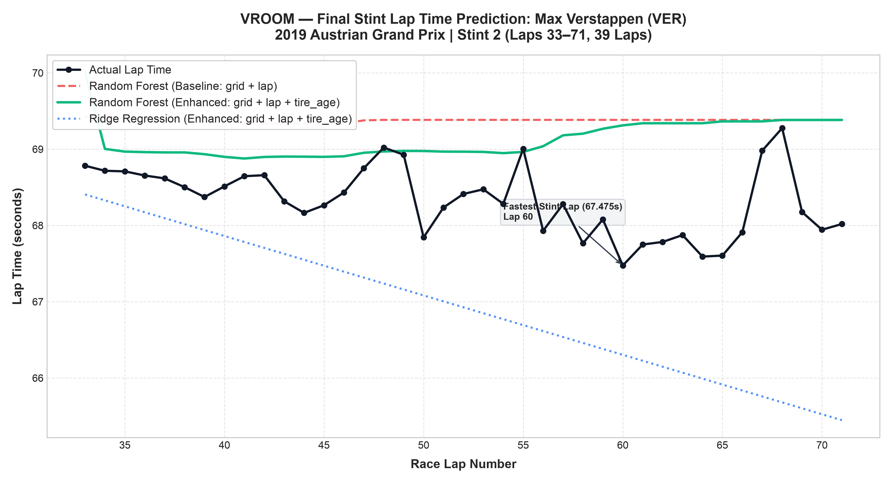

# VROOM: Formula 1 Lap Time Predictor
### Classical Machine Learning & Stint-Based Degradation Modeling
**Option A: Formula One Lap Time Predictor**



---

## 1. Project Overview
**VROOM** is a machine learning project that predicts Formula 1 lap times within a single Grand Prix using classical regression algorithms. The objective is to evaluate whether augmenting baseline race features (`grid` position and `lap` number) with an engineered `tire_age` feature (flying laps elapsed since the last pit stop) improves lap time forecasting across unseen final race stints.

---

## 2. Dataset & Selected Race

* **Source Dataset:** Kaggle *"Formula 1 World Championship (1950 to 2024)"* by Rohan Rao.
* **Selected Grand Prix:** **2019 Austrian Grand Prix**
  * `raceId`: **1018**
  * Circuit: **Red Bull Ring (Spielberg, Austria)**
  * Scheduled Distance: **71 laps**
  * Date: **June 30, 2019**

### Verified Dataset Facts vs. Externally Verified Facts

| Criterion | Status | Detail |
| :--- | :--- | :--- |
| **Pit Stop Availability** | **VERIFIED FROM DATA** | `pit_stops.csv` contains complete, structured pit stop records for this event (all 20 starters conducted pit stops). |
| **Lap Records Integrity** | **VERIFIED FROM DATA** | `lap_times.csv` contains unbroken, sequential lap sequences (1 to 70/71) with zero duplicate records and zero missing values. |
| **Classified Finishers** | **VERIFIED FROM DATA** | All 20 selected-race drivers were classified in the official results; 5 completed the full 71-lap distance and 15 finished one lap behind. |
| **Dry Track Condition** | **EXTERNALLY VERIFIED** | *Not recorded in CSV schema.* Historically verified via official FIA timing bulletins: ambient temperature ~31°C, track temperature ~50°C, dry asphalt, 0% precipitation. All drivers ran exclusively on dry slick compounds (Soft, Medium, Hard). |
| **Zero Red Flags / SC** | **EXTERNALLY VERIFIED** | *Not recorded in CSV schema.* The race ran green for all 71 laps with zero red flags, zero full Safety Cars, and zero Virtual Safety Cars (confirmed by data audit: 0 laps $> 1.5\times$ driver median). |

---

## 3. Selected Driver Cohort (10 Classified Finishers)

The modeling cohort consists of the top 10 classified finishers, representing balanced multi-stint race strategies:

| Pos | driverId | Driver Name | Code | Team / Constructor | Grid | Status | Completed Laps | Pit Stops | Potential Stints |
| :---: | :---: | :--- | :---: | :--- | :---: | :---: | :---: | :---: | :---: |
| **P1** | 830 | Max Verstappen | VER | Red Bull Racing | 2 | Finished | 71 | 1 (Lap 31) | 2 |
| **P2** | 844 | Charles Leclerc | LEC | Ferrari | 1 | Finished | 71 | 1 (Lap 22) | 2 |
| **P3** | 822 | Valtteri Bottas | BOT | Mercedes | 3 | Finished | 71 | 1 (Lap 21) | 2 |
| **P4** | 20 | Sebastian Vettel | VET | Ferrari | 9 | Finished | 71 | 2 (Laps 21, 50) | 3 |
| **P5** | 1 | Lewis Hamilton | HAM | Mercedes | 4 | Finished | 71 | 1 (Lap 30) | 2 |
| **P6** | 846 | Lando Norris | NOR | McLaren | 5 | +1 Lap | 70 | 1 (Lap 25) | 2 |
| **P7** | 842 | Pierre Gasly | GAS | Red Bull Racing | 8 | +1 Lap | 70 | 1 (Lap 25) | 2 |
| **P8** | 832 | Carlos Sainz | SAI | McLaren | 19 | +1 Lap | 70 | 1 (Lap 41) | 2 |
| **P9** | 8 | Kimi Räikkönen | RAI | Alfa Romeo | 6 | +1 Lap | 70 | 1 (Lap 23) | 2 |
| **P10** | 841 | Antonio Giovinazzi | GIO | Alfa Romeo | 7 | +1 Lap | 70 | 1 (Lap 24) | 2 |

---

## 4. Data Cleaning Pipeline

Cleaning rules are applied deterministically to remove non-flying pace laps:

1. **Rule 1 — Pit In-Lap Removal:** Laps where a pit stop was recorded in `pit_stops.csv` are dropped (11 laps).
2. **Rule 2 — Pit Out-Lap Removal:** The lap immediately following a pit stop ($P+1$) is dropped (11 laps).
3. **Rule 3 — Slow Lap Removal ($> 1.5 \times \text{Driver Median}$):** Calculated per driver across the remaining clean flying laps to filter out yellow flags or pace anomalies (0 laps in this green race).

### Cleaning Audit Summary

| Cleaning Stage | Removed Laps | Retained Laps | Description |
| :--- | :---: | :---: | :--- |
| **Initial Raw Records** | — | **705** | Total laps for the 10 selected drivers in Race 1018 |
| **Rule 1: Pit In-Laps** | 11 | 694 | 9 drivers $\times$ 1 stop $+$ 1 driver $\times$ 2 stops |
| **Rule 2: Out-Laps ($P+1$)** | 11 | 683 | Immediate out-lap following each pit stop |
| **Rule 3: Laps $> 1.5\times$ Median** | 0 | 683 | Zero slow lap anomalies detected |
| **Final Clean Modeling Data** | **22** | **683** | **Retained clean flying laps for modeling** |

---

## 5. Feature Engineering: Stints & Tire Age

* **Stint Construction:**
  * **Stint 1:** Clean flying laps prior to Pit Stop 1.
  * **Stint 2 (Vettel):** Clean flying laps between Pit Stop 1 and Pit Stop 2.
  * **Final Stint ($S_{\text{final}}$):** Clean flying laps following the driver's final pit stop.
* **`tire_age` Convention:**
  * **Stint 1:** Lap 1 receives `tire_age = 0`, Lap 2 receives `tire_age = 1`, incrementing by 1.
  * **Subsequent Stints:** For a pit stop at lap $P$, the in-lap $P$ and out-lap $P+1$ are removed. The first retained flying lap of the new stint is Lap $P+2$, which receives `tire_age = 0`. Each subsequent valid flying lap increments by 1:
    $$\text{tire\_age}_{d, l} = l - (P_k + 2) \quad \text{for } l \ge P_k + 2$$

---

## 6. Stint-Based Train/Test Split (Non-Random)

To emulate realistic race-day deployment (predicting future stints on unseen tyre sets), data is split by stint boundaries:
* **Training Set:** Earlier Stints ($S_1 \dots S_{\text{last}-1}$) $\implies$ **280 laps (41.0%)**
* **Testing Set:** Final Stint ($S_{\text{final}}$) for all 10 drivers $\implies$ **403 laps (59.0%)**
* **Zero Leakage:** No laps from any driver's final stint appear in the training partition.

---

## 7. Machine Learning Models & Evaluation

Two distinct classical algorithms were evaluated across baseline and enhanced feature sets:
1. **Ridge Regression:** Regularized linear model with standard feature scaling (`alpha=1.0`).
2. **Random Forest Regressor:** Non-linear decision tree ensemble (`n_estimators=100`, `max_depth=6`, `random_state=42`).

### Model Performance Comparison

| Model | Feature Set | Test RMSE (s) | Test MAE (s) | Train RMSE (s) | Train MAE (s) |
| :--- | :--- | :---: | :---: | :---: | :---: |
| **Ridge Regression** | Baseline (`grid`, `lap`) | 2.0461 s | 1.7534 s | 1.1394 s | 0.6805 s |
| **Ridge Regression** | Enhanced (`grid`, `lap`, `tire_age`) | 2.0686 s | 1.7852 s | 1.1392 s | 0.6789 s |
| **Random Forest** | Baseline (`grid`, `lap`) | **0.8043 s** | **0.6448 s** | 0.4165 s | 0.2364 s |
| **Random Forest** | Enhanced (`grid`, `lap`, `tire_age`) | **0.8319 s** | **0.6599 s** | 0.4250 s | 0.2455 s |

### Key ML Insights:
* **Linear vs Non-Linear Regimes:** The Random Forest regressor outperforms linear Ridge regression by **over 1.2 seconds in RMSE** (~0.80s vs ~2.05s). Formula 1 lap times follow non-linear trajectories driven by fuel burn-off (~0.03s per lap gained) combined with progressive tyre degradation.
* **Evaluation of Tire Age Feature:** Adding `tire_age` did **NOT** improve test-set performance in this experiment:
  * **Ridge Regression:**
    * Baseline RMSE = `2.0461s` $\to$ Enhanced RMSE = `2.0686s` (Change: `+0.0225s`)
    * Baseline MAE = `1.7534s` $\to$ Enhanced MAE = `1.7852s` (Change: `+0.0318s`)
  * **Random Forest Regressor:**
    * Baseline RMSE = `0.8043s` $\to$ Enhanced RMSE = `0.8319s` (Change: `+0.0276s`)
    * Baseline MAE = `0.6448s` $\to$ Enhanced MAE = `0.6599s` (Change: `+0.0151s`)
  * **Methodological Explanation:** In this non-random stint-based split, `tire_age` did not provide additional predictive benefit over grid position and lap number. Within a single final stint, `tire_age` is strongly related to lap number, so it provides largely redundant information rather than clearly independent signal. The baseline Random Forest already captures much of the race progression using grid position and lap number.
  * *Note:* This does not claim that tire degradation is scientifically irrelevant; it reflects the findings from this particular race, driver cohort, feature set, and evaluation setup.

---

## 8. Stint Visualization (Max Verstappen — Race Winner)

The plot below shows Max Verstappen's 39-lap final test stint (Laps 33 to 71), comparing actual lap times against baseline and enhanced models:

* **File Location:** [`outputs/stint_prediction_verstappen.png`](outputs/stint_prediction_verstappen.png)
* **Race Context & Error Analysis:** Verstappen mounted an aggressive late-race charge on fresh Hard tyres, setting the fastest lap of the stint (67.475s on Lap 60) and overtaking Charles Leclerc on Lap 69 to take victory. Across Verstappen's 39-lap final stint, the Enhanced Random Forest model achieves an MAE of 0.800s and generally follows the overall lap-time trend, although larger errors occur on individual laps.

---

## 9. Project Directory Structure

```
VROOM/
├── README.md                           # Comprehensive project documentation
├── requirements.txt                    # Pinned Python dependencies
├── main.py                             # Standalone pipeline execution script
├── vroom_f1_lap_time_predictor.ipynb   # Complete, fully executed Jupyter Notebook
├── src/
│   ├── data_pipeline.py                # Ingestion, merging, cleaning & stint splitting
│   ├── models.py                       # Ridge & Random Forest training & evaluation
│   └── visualize.py                    # High-res stint visualization generator
├── outputs/
│   ├── metrics_summary.csv             # Exported performance comparison table
│   └── stint_prediction_verstappen.png # 300 DPI stint visualization
└── [Kaggle CSV files]                  # lap_times.csv, pit_stops.csv, results.csv, races.csv, etc.
```

---

## 10. Reproducibility & Instructions to Run

### Setup Environment
```bash
# Clone or open the repository
cd VROOM

# Create virtual environment
python3 -m venv .venv
source .venv/bin/activate

# Install dependencies
pip install -r requirements.txt
```

### Run the Pipeline
```bash
python main.py
```

### Run the Jupyter Notebook
```bash
jupyter lab vroom_f1_lap_time_predictor.ipynb
```
All random seeds are pinned to `RANDOM_STATE = 42` for complete determinism across all runs.
